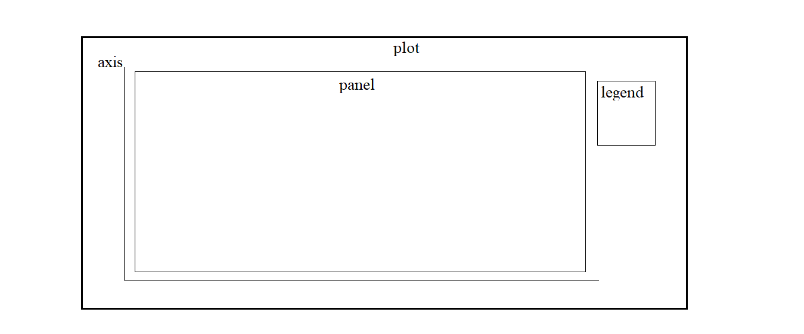

```{r setup, include=FALSE}
knitr::opts_chunk$set(echo = TRUE)
```

# Data Visualization

## Day 3

### ggplot basic
konsep ggplot seperti kita sedang menggambar di sebuah kanvas.  
1. pertama kita buat dulu layout nya dengan cara `ggplot(data = data, aes(x = x , y = y))`  
2. Kemudian beri parameter + layer geometries untuk memilih tipe plot yang diinginkan.  
   - `geom_point` = visualisasi poin sama seperti scatter plot. 
   - `geom_col` = menampilkan sebaran data yang diskrit.  
   - `geom_jitter` = mengatasi kasus overlapping poin dengan cara menyebar poin secara random.  
   - `geom_text` = menambahkan text.  
   - dan masih banyak lagi.   
3. `labs()` untuk mengatur title, subtitle, xlabs, ylabs dari grafik.     
4. paramter `theme()`:      
   - jalankan `?theme` pada console R kemudian akan muncul detail penjelasan seluruh parameter theme.     


### How to use melt. 
beberapa parameter yang ada pada melt yaitu:    
`data` merupakan data frame yang akan digunakan   
`id.vars` variabel yang akan digunakan sebagi acuan   
`variable.name` nama kolom variabel setelah di melt   
`value.name` nama kolom value setelah di melt   

```{r}
library(ggplot2)
library(reshape2)
laporan <- data.frame(produk=c("Mangga","Jambu", "Apel"), 
                      tahun2015= c(12,21,25),
                      tahun2016=c(32,35,40),
                      tahun2017=c(33,30,31))
# melt(data, id.vars= variabel yang diguna)
laporan <- melt(laporan,id.vars = "produk", variable.name = "tahun", value.name = "total")
laporan$tahun <- as.numeric(gsub("tahun","",laporan$tahun))
laporan

ggplot(data = laporan, aes(x = tahun, y=total))+
  geom_line(aes(linetype=produk, col=produk))
```


### soal latihan

Buat bar plot antara  `title` dan `views` pada video yang  `channel_title` == "INSIDER" lalu tambahkan labs
dataframe yang digunakan vids.u

```{r eval=FALSE} 
vid.in <- vids.u[vids.u$channel_title=="INSIDER",]

ggplot(data =vid.in ,aes(x=reorder(title, views), y=views))+
  geom_col()+
  coord_flip()+
  labs(title ="Jumlah Views channel INSIDER",
       x ="Judul Video" ,
       y = "Views")+
  theme(plot.title = element_text(hjust = 0))
```


### custom theme()

disini saya menerapkan beberapa paramenter pada theme ke dataset laporan yang sudah kita buat sebelumnya:

```{r}
ggplot(data = laporan, aes(x = tahun, y=total))+
  geom_line(aes(linetype=produk, col=produk))+
  labs(title = "Pergerakan jumlah produk buah per tahun")+
  theme(plot.background = element_rect(fill = "grey"), # mengubah warna plot menjadi abu2
        panel.background = element_rect(fill = "white"), # mengubah warna panel menjadi putih
        panel.grid = element_line(colour = "grey"), # mengubah garis grid menjadi abu2
        plot.title = element_text(face = "italic", size = 15), # membuat judul menjadi italic dan size font 15
        panel.grid.major.x = element_blank() # menghapus grid major pada sumbu x
        )
```

### refrensi
untuk eksplorasi lebih lanjut tentang ggplot, berikut saya lampirakan link-link yg bisa dijadikan refrensi tambahan:    
- Top 50 ggplot visualization master list. http://r-statistics.co/Top50-Ggplot2-Visualizations-MasterList-R-Code.html   
- cheatsheet Ggplot2 https://www.rstudio.com/wp-content/uploads/2015/03/ggplot2-cheatsheet.pdf    


