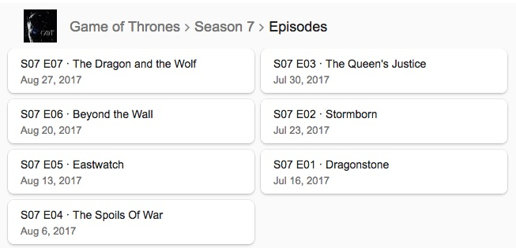

```{r setup, include=FALSE}
knitr::opts_chunk$set(echo = TRUE)
options(scipen = 123)
```

## Sekilas tentang Game of Thrones
**Game of Thrones** adalah serial televisi populer dari Amerika Serikat yang diadaptasi dari seri novel fantasi berjudul *A Song of Ice and Fire* karya George R. R. Martin. Ditayangkan pertama kali di HBO pada tanggal *17 April 2011*, dan akhirnya akan segera tamat pada season ke-8 yang akan tayang perdana pada tanggal *14 April 2019* mendatang.

## Pengenalan
Dalam Analisis Time Series ini, saya mencoba melakukan forecasting terhadap perkiraan jumlah view halaman wikipedia Game of Throne dalam kurun waktu satu tahun ke depan.

## Membaca Data
Data `wiki_got_views.csv` merupakan data jumlah view harian dari dari halaman wikipedia *Game of Thrones* dimulai dari tanggal *01 Juli 2015* hingga *16 Maret 2019*. Proses pengunduhan data dilakukan pada file `wiki_got.R`, dimana saya menggunakan library R *pageviews* dan fungsi `article_pageviews()` untuk mendapatkan semua data viewnya.
```{r}
got <- read.csv("data_input/wiki_got_views.csv")
str(got)
```

Menggunakan library `dplyr` saya melakukan perubahan nama dan tipe variabel dengan `mutate()` dan kemudian dilakukan seleksi variabel yang dibutuhkan untuk proses *forecasting* selanjutnya.
```{r}
library(dplyr)
got <- got %>% 
  mutate(ds = as.Date(date), y = views) %>% 
  select(ds, y)
```

Saya menggunakan library `prophet` untuk proses *forecasting* dalam analisis ini. Dikembangkan secara open-source oleh tim Data Science milik Facebook, `prophet` sangat kuat dalam menangani permasalahan data yang hilang, pergeseran tren, dan juga nilai *outlier*

Untuk dapat menggunakan library ini, dibutuhkan sebuah dataframe dengan dua buah kolom bernama `ds` untuk *data bertipe tanggal* dan `y` sebagai nilai dari *time series*-nya
```{r}
library(prophet)
got_prophet_model <- prophet(got)
```

Selanjutnya digunakan `make_future_dataframe()` untuk membuat sebuah objek dataframe baru yang mempunyai tambahan baris data baru yang merupakan data 365 hari (1355 + 365 = 1720) ke depan dari data sebelumnya. Dataframe baru ini mempunyai 1720 baris dengan hanya satu variabel bernama `ds`.
```{r}
got_future_df <- make_future_dataframe(got_prophet_model, periods = 365)
tail(got_future_df)
```

Menggunakan fungsi `predict()` bawaan dari R, dilakukan sebuah forecast menggunakan model `prophet` dan dataframe baru yang sudah kita buat sebelumnya. 
```{r}
got_pred <- predict(got_prophet_model, got_future_df)
str(got_pred)
```


//TANYA
```{r}
actual_pred <- cbind(got, got_pred[1:nrow(got), c("yhat_lower", "yhat", "yhat_upper")])
head(actual_pred)
```

Dengan kemampuan *plotting* dari `prophet`, kita dapat mem-plot forecast berdasarkan observasi data sebelumnya
```{r}
plot(got_prophet_model, got_pred)
```
Dari plot di atas, dapat kita simpulkan bahwa view dari halaman ini akan meningkat secara signifikan dimulai dari Q2 hingga Q3 setiap tahunnya, dengan alasan serial GoT tayang perdana setiap musimnya pada waktu tersebut (bulan April hingga September)

Ada pengecualian untuk tahun 2018 dikarenakan serial ini absen tayang pada tahun tersebut. 

Terdapat juga satu buah nilai *outlier* di sekitar pertengahan tahun 2017, dimana saat itu sedang ditayangkan season 7 sebagai season yang paling baru dan ditunggu fans-nya. 




Dengan `prophet`, dapat dilakukan proses decompose menggunakan fungsi `prophet_plot_components()`
```{r}
prophet_plot_components(got_prophet_model, got_pred)
```
Melihat grafik *trend*, tahun 2018 terjadi penurunan secara signifikan jumlah view dikarenakan hiatus-nya serial ini. Namun menjelang akhir tahun, jumlah view akan semaking meningkat seiring *hype* dari seri semakin membumbung tinggi.

Hari Minggu dan Senin merupakan dua hari dengan tingkat kenaikan view yang tinggi, yang sangat dipengaruhi oleh waktu penayangan perdana serial ini di hari Minggu malam waktu Amerika Serikat.

Awal bulan April hingga akhir bulan Agustus merupakan saat dimana jumlah view cenderung meningkat, karena merupakan waktu penayangan perdana serial tersebut setiap musimnya. 


## Kesimpulan
Berdasarkan hasil analisa forecasting ini, saya bisa menyimpulkan adanya sebuah pola kenaikan dan penurunan jumlah view dari halaman Wikipedia Game of Thrones ini. Pola tersebut adalah:

1. Sekitar beberapa hari sebelum penayangan perdana musim terbaru dari Game of Thrones, akan terjadi peningkatan jumlah view secara signifikan
2. Hari Minggu dan Senin akan menjadi hari dengan trafik tertinggi setiap minggunya selama serial ini masih tayang.
3. Q1 dan Q4 tiap tahunnya adalah saat terendah jumlah view