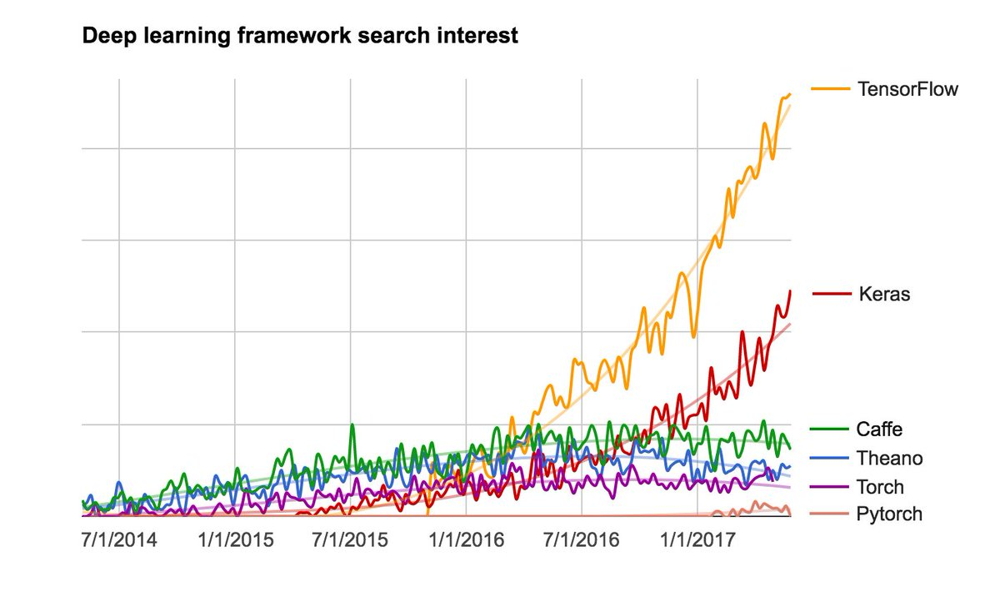
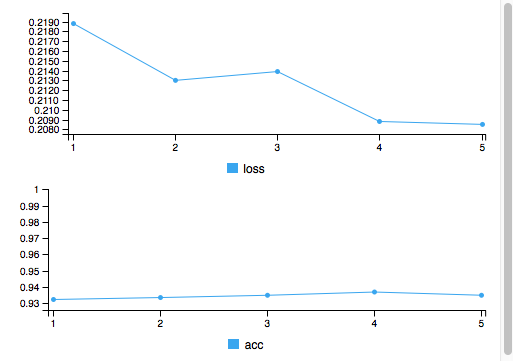

```{r setup, include=FALSE}
knitr::opts_chunk$set(echo = TRUE)
options(scipen = 123)
```

## Apa itu Neural Network dan Deep Learning?
(Artificial) Neural network adalah sebuah model yang terinspirasi dari proses kerja otak manusia. Tiap neuron dalam otak manusia saling berhubungan dan informasi mengalir dari setiap neuron tersebut.

Deep Learning adalah salah satu cabang keilmuan dari *Machine Learning (ML)* yang menggunakan *Deep Neural Network* untuk menyelesaikan permasalahan pada domain ML.

Beberapa kegunaan dari Deep Learning adalah sebagai berikut:

- Mengenali wajah atau *Face Recognizition*
- Mendeteksi pola tulisan tangan
- Mendeteksi suara dan kalimat
- *Natural Language Processing*
- *Recommendation Systems*
- dan sebagainya

## Framework Deep Learning Populer
Saat ini kita mengenal cukup banyak *framework* untuk penggunaan *deep learning*. Beberapa yang cukup populer di antaranya adalah: *Tensorflow*, *Keras*, *MXNet*, dan *PyTorch*.

Berikut adalah grafik tingkat kepopuleran framework deep learning dari 2014 hingga 2017 (data lama):


## Berkenalan dengan Keras
Pada analisis ini, saya hanya akan menggunakan framework *Keras* dengan bantuan R interface dari *RStudio*.

Keras adalah *high-level neural network API* yang dikembangkan dengan *Python* dengan fokus tujuan untuk mempercepat proses riset atau percobaan.

Beberapa fitur utama dari Keras:

- Mampu menjalankan *source code* yang sama menggunakan CPU atau GPU dengan lancar
- API yang *user-friendly* sehingga mempermudah penggunanya dalam proses prototipe model deep learning
- Dukungan *built-in* untuk CNN atau Convolutional Neural Networks (Computer Vision), RNN atau Recurrent Neural Networks (untuk *sequence processing*), dan kombinasi keduanya
- Dapat digunakan untuk hampir semua jenis dari model deep learning

## Spesifikasi untuk menggunakan Tensorflow
Tensorflow sebagai back-end utama dari Keras mempunyai minimum persyaratan sebagai berikut:

* Ubuntu 16.04 dan setelahnya
* Windows 7 dan setelahnya
* macOS 10.12.6 (Sierra) dan setelahnya (tidak ada dukungan GPU)
* Raspbian 9.0 dan setelahnya

Untuk versi Python yang didukung adalah:
v3.4, v3.5, dan v3.6

*PERHATIAN: Tensorflow akan memiliki masalah pada Python v3.7*


## Dataset Fashion MNIST
Dataset yang saya gunakan untuk proses pembelajaran neural network ini adalah *Fashion MNIST*. Dataset ini merupakan sebuah kumpulan 70,000 buah gambar hitam-putih yang memiliki 10 kategori dan direpresentasikan dalam sebuah pixel berukuran 28x28.


## Pre-processing
Saya menggunakan library `keras` yang tersedia dari CRAN dan `data.table` untuk keperluan pre-processing data. Library `data.table` menyediakan fungsi `fread()` untuk mempercepat proses pembacaan data khususnya untuk data yang berukuran besar.
```{r}
library(keras)
library(data.table)

fashion_train <- fread("data_input/fashionmnist/train.csv")
fashion_test <- fread("data_input/fashionmnist/test.csv")
dim(fashion_train)
dim(fashion_test)
```
Saya menggunakan 60,000 gambar sebagai data train untuk melatih model neural network dan 10,000 gambar sebagai data test untuk menguji tingkat akurasi dari model tersebut untuk mengklasifikasikan gambar yang ada.

Supaya dapat direpresentasi sebagai kisaran nilai antara 0 sampai 1, maka masing-masing data train dan test terlebih dahulu dijadikan matriks, lalu dibagi dengan 255 (nilai terbesar sebuah piksel)
```{r}
x_train <- data.matrix(fashion_train[,-1]) / 255
x_test <- data.matrix(fashion_test[,-1]) / 255
dim(x_train)
dim(x_test)
```

`y_train` dan `y_test` adalah sebuah label klasifikasi untuk 10 buah jenis gambar yang ada 
```{r}
y_train <- fashion_train$label
y_test <- fashion_test$label
str(y_train)
str(y_test)
```


Mempersiapkan model menggunakan fungsi `keras_model_sequential()` bawaan dari library `keras`. Model deep learning ini terdiri dari beberapa layer yang dirangkai bersama dalam satu buah model.
```{r}
model <- keras_model_sequential()
# model %>% 
#   layer_dense(units = 256, activation = "relu", input_shape = c(784)) %>% 
#   layer_dropout(rate = 0.4) %>% 
#   layer_dense(units = 128, activation = "relu") %>% 
#   layer_dropout(rate = 0.3) %>% 
#   layer_dense(units = 10, activation = "softmax")

model %>% 
  layer_flatten(input_shape = c(784)) %>% 
  layer_dense(units = 128, activation = "relu") %>% 
  layer_dense(units = 10, activation = "softmax")

summary(model)
```

Sebelum model siap untuk proses training, dibutuhkan beberapa pengaturan melalui fungsi `compile()`, di antaranya:

- `loss` : untuk mengukur seberapa akurat model selama proses training.
- `optimizer` : untuk meliaht bagaimana model berubah berdasarkan data yang dilihat dan juga *loss function* nya.
- `metrics` : untuk memantau tiap langkah dalam proses training dan testing. Pada analisis ini digunakan `accuracy`, seberapa akurat gambar-gambar yang berhasil diklasifikasikan dengan benar.
```{r}
model %>% compile(
  loss = "sparse_categorical_crossentropy",
  optimizer = optimizer_rmsprop(),
  metrics = c("accuracy")
)
```

Proses training dalam model neural network memerlukan tahapan sebagai berikut:

- Memasukkan data train ke dalam model yaitu `x_train` dan `y_train`
- Model mempelajari cara untuk mencocokkan gambar `x_train` dan label `y_train`
- Kemudian dibuat prediksi menggunakan data test `x_test`

Untuk memulai proses training digunakan fungsi `fit()`
```{r}
history <- model %>% fit(
  x_train, y_train,
  epochs = 5
)
```



Dari hasil train tersebut, didapat nilai akurasi sekitar 93%.

Kemudian kita bandingkan tingkat akurasi dari dataset test menggunakan fungsi `evaluate()`
```{r}
model %>% evaluate(x_test, y_test)
```
Didapat nilai akurasi dari data test sedikit lebih kecil dari data training. Adanya perbedaan nilai akurasi ini merupakan contoh dari *overfitting* yang artinya sebuah model machine learning memiliki performa yang lebih buruk pada data baru dibandingkan dengan data training.


## Membuat Prediksi
Dengan model yang sudah *di-train*, saya dapat melakukan prediksi beberapa gambar berdasarkan 10 kategori yang sudah disiapkan.

Fungsi `predict_classes()` digunakan untuk memprediksi klasifikasi dari masing-masing data.
```{r}
categories = c('T-shirt',
                'Trouser',
                'Pullover',
                'Dress',
                'Coat', 
                'Sandal',
                'Shirt',
                'Sneaker',
                'Bag',
                'Boot')

class_pred <- model %>% predict_classes(x_test)
table(class_pred)
```


Fungsi `plotResults()` digunakan untuk membuat plot beberapa gambar disertai dengan nilai prediksi mereka dalam bentuk kategori angka
```{r}
plotResults <- function(images) {
  x <- ceiling(sqrt(length(images)))
  par(mfrow = c(x,x), mar = c(.1,.1,.1,.1))
  
  for (i in images) {
    m <- matrix(x_test[i,], nrow = 28, byrow = TRUE)
    m <- apply(m, 2, rev)
    image(t(m), col = grey.colors(255), axes = FALSE)
    
    predicted_label <- class_pred[i]
    true_label <- y_test[i]
    
    if(predicted_label == true_label) {
      color <- "green"
    } else {
      color <- "red"
    }
    
    text(0.5, 0.1, col = color, cex = 1.5, categories[predicted_label+1])
  }
}
```

```{r}
plotResults(1:100)
```

## Kesimpulan
* Proses klasifikasi dengan menggunakan model neural network dari Keras ternyata cukup menghemat waktu khususnya dalam efisiensi kinerja CPU dan GPU
* Ketika data *overfitting*, maka nilai akurasi yang tinggi pada model dengan data train tidak begitu mempengaruhi akurasi pada data test.


## References
- [Pengenalan Deep Learning Part 1 : Neural Network](https://medium.com/@samuelsena/pengenalan-deep-learning-8fbb7d8028ac)
- [Wikipedia Deep Learning](https://en.wikipedia.org/wiki/Deep_learning)
- [Deep Learning Frameworks](https://twitter.com/fchollet/status/871089784898310144)