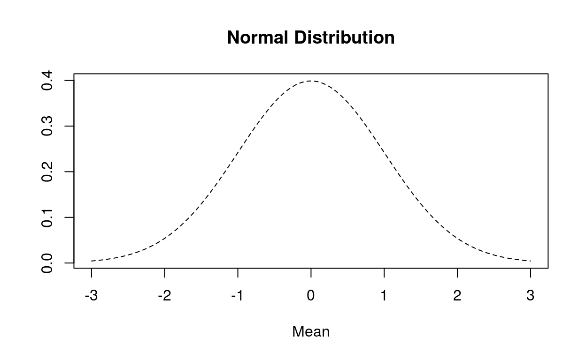

# Algoritma Academy: Practical Statistics
## author: "Enlik Tjioe"
## date: "Jan 17-18, 2019"
[Pre-PS Link](https://samuelc.shinyapps.io/preps/)

 
 

## Bab 1: Statistika Deskriptif
### 1.1 Kegunaan
* **Statistika deskriptif/Descriptive Statistics** digunakan untuk memberikan gambaran ringkas dan informasi inti dari kumpulan data yang ada.
* IPK merupakan salah satu contoh statistik deksriptif yang merepresentasikan kesulurahan hasil akademik mahasiswa selama menempuh pendidikan di perguruan tinggi

### 1.2 Dua Tipe Statistik Deskriptif
#### 1.2.1 Ukuran Pemusatan Data
* mean
* median
* modus

#### 1.2.2 Ukuran Penyebaran Data
* **variansi dan standar deviasi**: ukuran penyebaran data di sekitar mean. Standar deviasi merupakan akar kuadrat dari variansi. Gunakan `var()` dan `sd()` dalam R
* **jangkauan**: selisih data terbesar dan data terkecil. Gunakan `max()-min()` atau `diff(range())` dalam R
* **interkuartil**: selisih kuartil ketiga (Q3) dan kuartil terkecil (Q1). Gunakan `IQR()` dalam R

Yang paling sering digunakan adalah standar deviasi(sd) karena sd merupakan rata-rata jarak setiap data ke mean. Sehingga ukuran ini cukup menggambarkan penyebaran data.

 
 

## Bab 2: Peluang dan Distribusi Normal
### 2.1 Ruang Sampel
* Proses survey penarikan sampel untuk memperoleh informasi yang nantinya akan digunakan dalam pengambilan keputusan ini, merupakan salah satu contoh dari proses percobaan statistik (eksperimen acak)
* Seluruh hasil keluaran yang mungkin muncul dari percobaan statistik ini dinamakan dengan **ruang sampel**
* Contoh ruang sampel dari survey pak Randi:
 * pembelian kursi
 * pembelian meja
 * pembelian lampu
 * pembelian elektronik
* Subset dari ruang sampel ini disebut dengan **kejadian** atau **event**, misalnya kejadian orang membeli kursi dan sebagainya
* Contoh pertanyaan:
 * Berapakah peluang sebuah rumah tangga akan membeli furniture lemari di tahun depan?
 * Berapa peluang orang yang telah membeli lemari akan membeli meja?
* Untuk menjawab pertanyaan ini dibutuhkan konsep mengenai peluang yang dibahas pada bab ini.

### 2.2 Peluang
* Peluang merupakan suatu ukuran yang menyatakan kemungkinan terjadinya suatu kejadian sebagai hasil dari percobaan statistik
* Nilai peluang = antara 0 dan 1
* Nilai peluang = rasio banyaknya suatu kejadian (n(E)) terhadap total banyaknya kejadian dalam ruang sampel (n(S)).
` P(E)=n(E)/n(S) `

### 2.3 Peubah acak / random variable
* Adalah: suatu variabel (X) yang mengaitkan setiap unsur dalam ruang sampel pada suatu **bilangan nyata (bilangan riil)**
* Peubah acak terbagi atas 2 jenis yaitu:
 1. **Peubah acak diskrit** : hanya mencakup nilai-nilai diskrit yang terhitung (0,1,2,3,…).
 2. **Peubah acak kontinu** : mencakup nilai-nilai numerik pada suatu selang
* Pada peubah acak, peluang untuk suatu kejadian dibentuk menjadi suatu fungsi peluang dan fungsi kumulatif dari peluang tersebut direpresentasikan menjadi fungsi distribusi

### 2.4 Fungsi Peluang
#### 1. Fungsi Peluang Peubah Acak Diskrit
* disebut dengan *probability mass function (pmf)* yang ditulis dengan simbol `P(X = x)` dimana `∑xP(X=x)=1` atau total peluang untuk seluruh titik kejadian yang mungkin adalah 1

#### 2. Fungsi Peluang Peubah Acak Kontinu
* disebut dengan *probability density function(pdf)* yang ditulis dengan simbol `f(x)` dimana `∫∞−∞f(x)dx=1`

### 2.5 Distribusi Normal
* Distribusi merupakan bentuk sebaran data
* Ini berguna sebagai indikasi dalam cara kita menganalisa data
* Distribusi normal adalah distribusi peluang kontinu yang paling penting dalam statistika dan paling sering digunakan dalam praktek sehari-hari

* Ciri-ciri utama distribusi normal ini adalah nilai mean, median, dan modusnya sama.
* Normal baku standar merupakan distribusi normal dengan mean 0 dan variansi 1.
* Banyak digunakan sebagai **asumsi** pada model-model statistik seperti:
 * regresi linier
 * uji hipotesi
 * anova

## Bab 3: Uji Hipotesis
### 3.1 Membuat Hipotesis
* Istilah statistika yang digunakan untuk membuat asumsi terhadap sebuah peristiwa yang akan diuji
* Hal ini dilakukan agar kita dapat mengambil kesimpulan dari seluruh **populasi**
* Contoh Hipotesis
 * **Hipotesis Nol (H0)** = Pengiriman barang furnitur ksofa-5 oleh toko retail tahun ini sama dengan atau lebih kecil dari 300
 * **Hipotesis Alternatif (H1)** = Pengiriman barang furnitur ksofa-5 oleh toko retail tahun ini melebihi 300
* Pengujian dilakukan dengan menggunakan **p-value**
* **p-value** adalah nilai peluang terjadinya suatu peristiwa yang sama atau lebih ekstrim dari nilai rata-rata sampel yang didapat di bawah asumsi bahwa *hipotesis nol benar*.
 
 

## Enlik's Class Notes 17 January 2019
* My question:
 * Bab 1 - Menentukan kapan menggunakan median, mean, dan modus? dan juga standar deviation, jangkauan, dan IQR.
 * Bab 2 - Penjelasan lebih dalam tentang Fungsi Peluang
 * Bab 3 - Penjelasan lebih tentang Hipotesis

